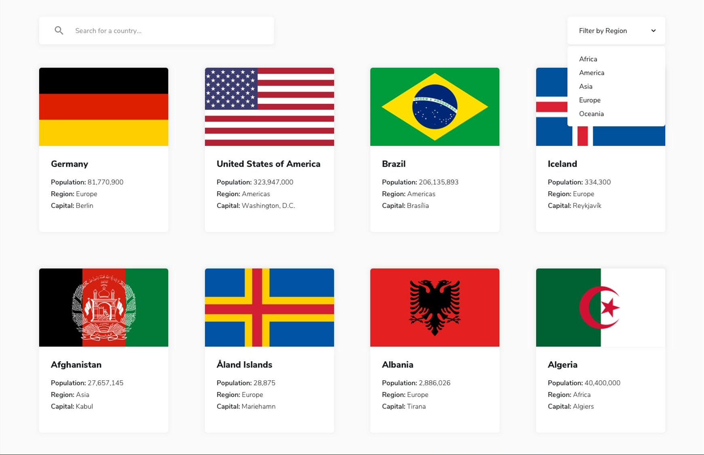
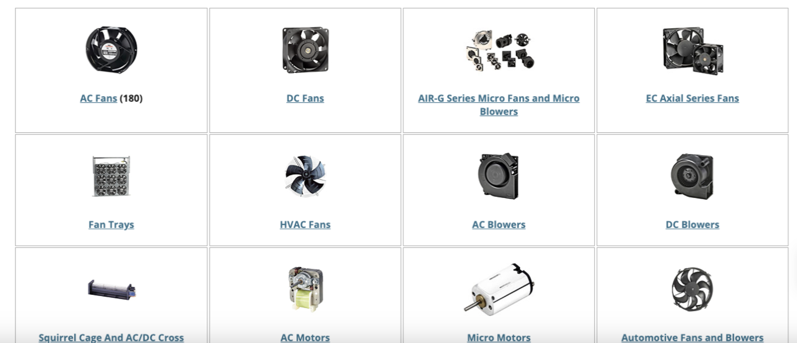

# Transactional Web Applications - Final Exam

This template repository is the starter project for Transactional Web App final exam. Written in HTML/CSS/JavaScript/React.js/Node.js/Express.js.

### Question(s)

Create a website that has the following functionalities:

- **(%8)** A list of random universities from the mentioned API (30 items) page
- **(%8)** A list of countries from the mentioned API depending on the 30 items that were chosen previously page with search and filter
- **(%8)** Use the given API to get the University and Country names and details
- **(%6)** Professional-looking User Interface (UI) using React.js

Example API 1 -> http://universities.hipolabs.com/search

Note:

- The list of items should be fetched from the APIs.
- Show the items in a component-based approach e.g. as follows:

